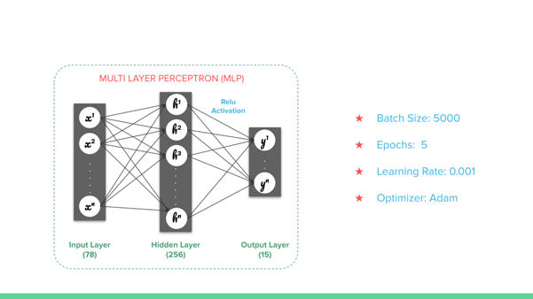

# W251 - Intrusion Detection with Federated Averaging
**Federated learning (FL)** is a setting where many clients (e.g. edge devices like cell phones, Jetsons, or Amazon Echo)  collaboratively train a model under the orchestration of a central server, while keeping the training data decentralized. 

With Federated learning (FL), you download the current model to your edge device, compute an updated model at the device itself using local data and you upload the details back to the Global Model.

As such it addresses -

 - **Privacy**: As local device specific training data is never uploaded to the server. 
 - **Lower Latency**: Updated model can be used to make predictions on device. 
 - **Decentralized Learning**: Gain experience from a broad diverse range of datasets. 
 - **Reduced Communication Overheads**: Only model weights are sent to the server not raw data.

## Links
[Presentation Slides](files/W251-FINAL-IntrusionDetectionUsingFedML.pdf)  
**Add link to our paper**

## System Architecture

## Model Architecture

