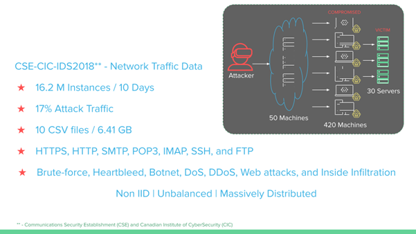

# W251 - Intrusion Detection with Federated Averaging

**Cybersecurity** has always been a field of cat-and-mouse games: defenders and attackers are constantly trying to stay one step ahead of the other in an effort to further their objectives, malicious or not. In the 21st century, there is no more a concept of "network perimeter" with organizations allowing Bring Your Own Data (BYOD), or hosting sensitive data on the cloud, which can be accessed from an authenticated computer or mobile device anywhere in the world. This immensely increases the attack surface, and to catch hackers in this domain, host and network intrusion detection using machine learning to identify anomalous behavior has proven to be very effective. 
  
The growth in the number of network connected devices (mobile phones, vehicles, IOT Appliances, etc.) has exponentially increased the volumes and sensitivity of network traffic data. This presents an additional challenge in building machine learning for anomaly detection which we aim to tackle using Federated Learning. 

**Federated learning (FL)** is a setting where many clients (e.g. edge devices like cell phones, Jetsons, or Amazon Echo)  collaboratively train a model under the orchestration of a central server, while keeping the training data decentralized. 

With Federated learning (FL), you download the current model to your edge device, compute an updated model at the device itself using local data and you upload the details back to the Global Model.

As such it addresses -

 - **Privacy**: As local device specific training data is never uploaded to the server. 
 - **Lower Latency**: Updated model can be used to make predictions on device. 
 - **Decentralized Learning**: Gain experience from a broad diverse range of datasets. 
 - **Reduced Communication Overheads**: Only model weights are sent to the server not raw data.

## Links
[Presentation Slides](files/W251-FINAL-IntrusionDetectionUsingFedML.pdf)  
**Add link to our paper**

## System Architecture

## Model Architecture

## Dataset Characteristics

## EDA & Training Data Setup

## Setup
Pre-requisites: One EC2 instance for the coordinator and 'N' edge devices (e.g. Jetsons) for the trainers.

To run this setup:
1. Run [start_mqtt_brkr.sh](fl-ids/start_mqtt_brkr.sh) to start the MQTT broker on the EC2 instance.
2. Run [start_aws_coordinator.sh](fl-ids/start_aws_coordinator.sh) to start the coordinator on the EC2 instance.
3. On each edge device (Jetson NX), run [start_jetson_docker.sh](start_aws_coordinator.sh) to do the required setup.
4. Download the training data on each of the edge devices and the test data on the EC2 instance.
5. Modify corresponding trainer scripts [fl-ids/trainer1_remote.py](fl-ids/trainer1_remote.py) to point to the respective data locations on all four edge devices.
6. Inside the docker containers in each of the edge device, run `python3 fl-ids/trainer1_remote.py`
7. Once all the trainers display a message "Waiting for model from coordinator...", run the `python3 fl-ids/coordinator_local.py` on the coordinator container in the EC2 instance.

The model will train for the specified number of epochs specified in the coordinator and will exit.

## Experimental Results

