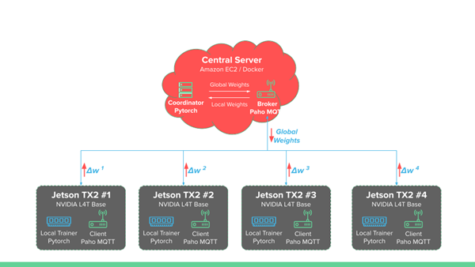

# W251 - Intrusion Detection with Federated Averaging
**Federated learning (FL)** is a setting where many clients (e.g. edge devices like cell phones, Jetsons, or Amazon Echo)  collaboratively train a model under the orchestration of a central server, while keeping the training data decentralized. 

With Federated learning (FL), you download the current model to your edge device, compute an updated model at the device itself using local data and you upload the details back to the Global Model.

As such it addresses -

 - **Privacy**: As local device specific training data is never uploaded to the server. 
 - **Lower Latency**: Updated model can be used to make predictions on device. 
 - **Decentralized Learning**: Gain experience from a broad diverse range of datasets. 
 - **Reduced Communication Overheads**: Only model weights are sent to the server not raw data.

## Links
[Presentation Slides](files/W251-FINAL-IntrusionDetectionUsingFedML.pdf)  
**Add link to our paper**

## System Architecture

## Model Architecture

## Setup
To run this setup:
1. Spin up a EC2 instance
2. Run [start_mqtt_brkr.sh](fl-ids/start_mqtt_brkr.sh) to start the MQTT broker on it.
3. Run this [start_aws_coordinator.sh](fl-ids/start_aws_coordinator.sh) to start the coordinator on the EC2 instance.
4. On each of the Jetson NX, run [start_jetson_docker.sh](start_aws_coordinator.sh) to get the required setup.
5. Download the training data on each of the Jetson devices and test data on the EC2 instance.
6. Modify corresponding trainer scripts [fl-ids/trainer1_remote.py](fl-ids/trainer1_remote.py) to point to the respective data locations on all four Jetson devices.
7. Inside the docker containers in each of the Jetson devices, run `python3 fl-ids/trainer1_remote.py`
8. After all the trainers say "Waiting for model from coordinator...", run `python3 fl-ids/coordinator_local.py` on the coordinator container in the EC2 instance.

The model will train for the number of epochs specified in the coordinator and will exit.

## Experimental Results

